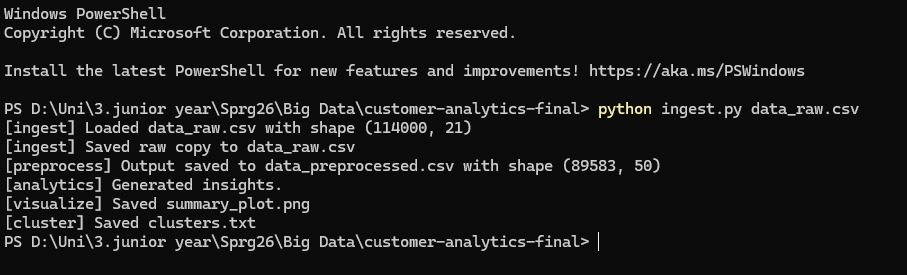
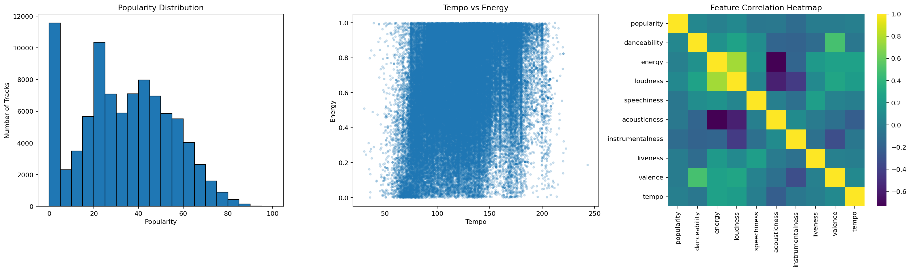

# Customer Analytics Pipeline

## Team Members
- Ohoud Khaled
- Gehad Maher
- Menna Ahmed
- Hanin Hazem

## Assignment Summary
This project implements a reproducible Docker-based data pipeline for a Spotify tracks dataset.
The pipeline performs ingestion, preprocessing, analytics, visualization, and clustering, then stores all generated deliverables in the `results/` folder.

## Project Structure
```text
customer-analytics/
├── Dockerfile
├── ingest.py
├── preprocess.py
├── analytics.py
├── visualize.py
├── cluster.py
├── summary.sh
├── README.md
└── results/
```

## Docker Build Command
```bash
docker build -t customer-analytics .
```

## Docker Run Command
```bash
docker run -it --name customer-analytics-container -v "${PWD}:/app/pipeline" customer-analytics
```

## Execution Flow
The scripts are chained automatically. Run only:
```bash
python ingest.py dataset.csv
```


Pipeline order:
1. `ingest.py` loads the dataset and saves `data_raw.csv`
2. `preprocess.py` creates `data_preprocessed.csv`
3. `analytics.py` creates `insight1.txt`, `insight2.txt`, and `insight3.txt`
4. `visualize.py` creates `summary_plot.png`
5. `cluster.py` creates `clusters.txt`

## Preprocessing Design

### Data Cleaning
- Removed the accidental index column `Unnamed: 0`
- Removed duplicate songs using `track_id`
- Filled missing values in text columns with `Unknown`
- Filled numeric missing values with the median
- Removed invalid rows where `duration_ms <= 0` or `tempo <= 0`

### Feature Transformation
- Converted the boolean `explicit` field to integer
- One-hot encoded the most frequent genres and grouped the rest into `other`
- Created a derived feature called `mood_score`
- Standard-scaled major numeric audio attributes

### Dimensionality Reduction
- Removed high-cardinality identifier columns from the model-ready table
- Selected a compact subset of audio features for analysis
- Applied PCA to create `pca1` and `pca2`

### Discretization
- Binned popularity into `low`, `medium`, and `high`
- Binned duration into `short`, `medium`, and `long`
- Binned tempo into `slow`, `medium`, and `fast`

## How to Collect Outputs
After running the container and the pipeline:
```bash
bash summary.sh customer-analytics-container
```


